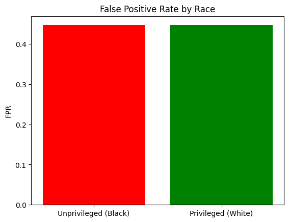

# AI-Ethics
# COMPAS Recidivism Bias Analysis with AI Fairness 360

## 📘 Project Overview
This project evaluates racial bias in the COMPAS Recidivism dataset using IBM's [AI Fairness 360](https://aif360.mybluemix.net/) toolkit. It specifically focuses on analyzing the **False Positive Rate (FPR)** across racial groups (Black vs. White) and explores remediation strategies for achieving fairness in predictive criminal justice systems.

---

## 🧠 Problem Statement
Predictive algorithms like COMPAS are increasingly used in judicial decisions (e.g., parole, bail). However, past research has shown these models may exhibit **racial bias**, especially in falsely predicting higher recidivism risk for Black individuals. Our goal is to assess these disparities and propose fairness-enhancing solutions.

---

## 🧪 Approach
1. **Data Preparation**:
   - Cleaned the dataset and mapped `race` to binary values (1 = Black, 0 = White).
   - Removed rows with missing values and encoded categorical features.
   
2. **Bias Evaluation**:
   - Used `BinaryLabelDataset` to structure the data.
   - Evaluated **Statistical Parity Difference** and **False Positive Rate**.
   - Visualized group-wise FPR to expose disparity.

3. **Remediation Suggestions**:
   - Pre-processing: Reweighing, Disparate Impact Remover
   - In-processing: Adversarial Debiasing
   - Post-processing: Equalized Odds Post-Processing

---

## 📊 Key Finding
The FPR for both unprivileged (Black) and privileged (White) groups was similarly high (~0.45). Although equal, this indicates the model is **consistently inaccurate**, raising fairness and reliability concerns.



---

## 🛠 Tools Used
- Python (Pandas, Matplotlib)
- IBM AI Fairness 360 (AIF360)
- Jupyter Notebook

---

## ✅ How to Run
1. Clone this repository.
2. Install dependencies:
   ```bash
   pip install pandas matplotlib aif360
